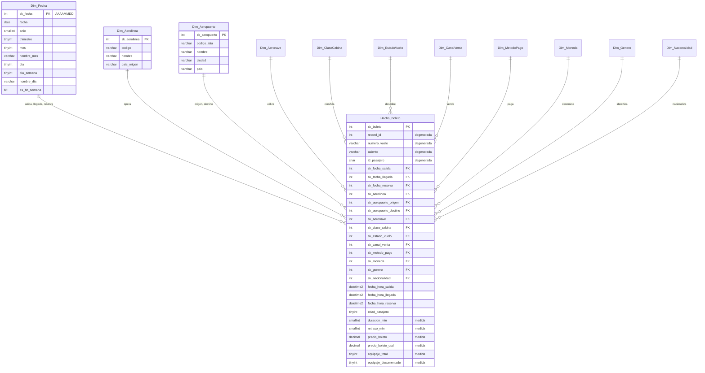

# Modelo multidimensional de vuelos

Este documento explica el modelo que se implemento en SQL Server para la
Practica 1 y las razones detras de las decisiones de diseno. Corresponde a la
parte de modelado y analisis del trabajo en pareja.

## El origen de los datos

Todo sale de `dataset_vuelos_crudo.csv`, un archivo de 10,000 registros y 26
columnas donde cada fila es el boleto de un pasajero en un vuelo. Trae datos del
vuelo, del pasajero y de la compra mezclados en la misma linea, y las salidas
cubren dos anios completos, del 1 de enero de 2024 al 31 de diciembre de 2025.

No es un archivo limpio. Los nombres de aerolinea aparecen con varias grafias,
los codigos de aeropuerto vienen en mayuscula y minuscula, el genero del pasajero
tiene doce variantes para tres valores reales y las fechas estan escritas en dos
formatos distintos. Buena parte del diseno que sigue existe precisamente para
absorber ese desorden sin perder registros.

## Que representa cada fila del hecho

El grano es un boleto de un pasajero en un vuelo, que es el nivel mas bajo que
ofrece la fuente.

Se eligio asi porque permite responder preguntas de dos naturalezas distintas sin
cambiar de modelo: las de operacion, como la puntualidad de cada aerolinea, y las
comerciales, como el ingreso por canal de venta. Tiene ademas una ventaja
practica, y es que cada registro del archivo produce exactamente una fila en la
tabla de hechos. Validar la carga se reduce entonces a comparar dos numeros.

## El esquema



Es un esquema estrella: `Hecho_Boleto` al centro y once dimensiones alrededor,
todas sin normalizar. Se descarto el copo de nieve porque los catalogos son
diminutos, entre tres y quince filas cada uno, y separarlos en tablas de segundo
nivel solo agregaria uniones a cambio de un ahorro de espacio que no existe.

La dimension mas grande es `Dim_Fecha`, con 1,462 filas: un calendario diario
desde 2023 hasta 2026 mas el miembro desconocido. El rango se estiro un anio a
cada lado del periodo de las salidas porque algunas reservas se hicieron en 2023
y conviene dejar margen. Las demas dimensiones son catalogos cortos, y
`Hecho_Boleto` cierra con las 10,000 filas del archivo.

## Por que no existe una dimension de pasajero

Es la decision menos obvia del modelo, asi que vale la pena detenerse.

Al perfilar el archivo aparece que `passenger_id` tiene 10,000 valores distintos
en 10,000 registros. Ningun pasajero se repite. Una dimension con una fila por
pasajero quedaria en relacion uno a uno con el hecho, lo que no habilita ningun
analisis nuevo y duplica el volumen de la tabla mas pesada del modelo.

La alternativa fue repartir los atributos del pasajero segun lo que cada uno
aporta. El genero y la nacionalidad se quedaron como dimensiones propias, porque
son catalogos cerrados de tres y once valores por los que si tiene sentido
agrupar. La edad se guarda como atributo numerico dentro del hecho y los rangos
etarios se arman en el momento de consultar, como se ve en I8; asi nadie tiene
que decidir de antemano donde cortar los grupos. Y el identificador del pasajero
se queda en el hecho como dimension degenerada, igual que `record_id`,
`flight_number` y `seat`, porque identifica la transaccion pero no describe nada.

## Aeropuertos y fechas cumplen mas de un papel

`Dim_Aeropuerto` se referencia dos veces desde el hecho, una como origen y otra
como destino. `Dim_Fecha` se referencia tres, como salida, llegada y reserva. En
ambos casos hay una sola tabla fisica y son las llaves foraneas las que definen
el papel; al consultar se distinguen con alias, como en I1, donde los mismos
aeropuertos entran dos veces con nombres distintos.

Duplicar las tablas habria sido mas facil de leer a primera vista, pero obligaria
a mantener el mismo catalogo en dos lugares y a recordar actualizar los dos.

## El miembro desconocido

Cada dimension incluye una fila con llave subrogada -1 y descripcion
DESCONOCIDO, y es la pieza que sostiene la validacion de la carga.

El archivo tiene huecos en varias columnas. Hay 560 vuelos cancelados que
logicamente no tienen hora de llegada, 209 nacionalidades vacias y 144 canales de
venta vacios. Sin un miembro al cual mandarlos, esas filas tendrian que quedar
con llave nula, y en cuanto se hiciera una union se perderian del resultado: los
conteos dejarian de cuadrar contra el total del archivo sin que nada avisara.

Con el miembro desconocido, en cambio, toda fila del hecho tiene siempre una
llave valida, las columnas `sk_` pueden declararse `NOT NULL` y la consulta V2 se
vuelve un reporte directo de cuanta informacion no se pudo homologar.

## Tres decisiones menores

Las dimensiones no usan `IDENTITY`. Como los catalogos son cerrados y se conocen
de antemano, las llaves se asignan a mano en `poblar_dimensiones.sql`. Eso
simplifica el ETL, que solo necesita buscar por el codigo natural, y hace la
carga reproducible: al volver a correr los scripts, las mismas llaves apuntan
siempre a los mismos valores.

El precio se guarda dos veces, en la moneda original de la compra y ya convertido
a dolares. Cualquier comparacion de ingresos usa la columna en dolares, porque el
archivo mezcla cuatro monedas y sumar la columna original no significaria nada.
La original se conserva para poder rastrear lo que realmente se le cobro al
cliente.

La duracion del vuelo es la que declara la fuente. En el archivo, la diferencia
entre la hora de llegada y la de salida no coincide con `duration_min` en 8,887
registros, con desviaciones de hasta media hora en ambos sentidos. Se tomo
`duration_min` como valor autoritativo y las horas quedaron para el analisis
temporal, no para recalcular nada. Ninguna consulta deriva la duracion restando.

## Lo que el ETL tiene que entregar

Esta seccion es el contrato con la fase de carga. Los nombres de tablas y
columnas son los que declara `crear_modelo.sql` y no deberian cambiar sin avisar,
porque las consultas analiticas dependen de ellos.

Varias columnas del archivo se usan tal cual, porque ya vienen limpias: los doce
codigos de `airline_code`, los doce modelos de `aircraft_type`, las cuatro clases
de `cabin_class`, los cuatro estados de `status`, los cinco metodos de
`payment_method` y las cuatro monedas de `currency`. Lo mismo aplica a
`ticket_price_usd_est`, a `bags_total` y `bags_checked`, y a los tres campos que
viajan al hecho como dimensiones degeneradas.

El resto necesita trabajo:

- `airline_name` se ignora por completo. Trae 23 grafias para 12 aerolineas y el
  codigo IATA ya identifica a cada una sin ambiguedad.
- `origin_airport` y `destination_airport` van en mayuscula. En el archivo hay
  402 origenes y 403 destinos escritos en minuscula.
- `passenger_gender` se reduce a tres codigos. `M`, `m`, `Masculino` y
  `masculino` se homologan a `M`; `F`, `f`, `Femenino` y `femenino` a `F`; `X`,
  `x`, `NoBinario` y `nobinario` a `X`.
- `passenger_nationality` se normaliza a mayuscula y los 209 vacios van al
  miembro desconocido, igual que los 144 vacios de `sales_channel`.
- `ticket_price` trae 930 registros con coma decimal, asi que hay que
  reemplazarla por punto antes de convertir a numero.
- `passenger_age` deja 112 nulos, y `duration_min`, `delay_min` y `seat` dejan
  560 cada uno, que son los vuelos cancelados. Todos se cargan como `NULL`, no
  como cero.

Con los valores ya homologados, la carga no inserta dimensiones: las consulta.
Cada codigo natural se busca en su catalogo y lo que no encuentre correspondencia
se resuelve como -1, para que ninguna fila se quede sin llave. La de fecha es el
entero `AAAAMMDD` de la parte de fecha de cada columna de fecha y hora, y tambien
-1 cuando viene vacia.

### Las fechas

Las tres columnas de fecha y hora mezclan dos formatos. La mayoria viene como
`dd/mm/yyyy HH:MM` y alrededor de mil quinientos registros de cada columna vienen
como `mm-dd-yyyy hh:MM AM/PM`. Basta con intentar el primero y caer al segundo si
falla; con esos dos se parsean los 10,000 registros sin excepcion.

Queda un problema mas incomodo. Hay 620 registros donde la hora de llegada
resulta anterior o igual a la de salida, y 621 donde la reserva resulta posterior
a la salida. En ambos casos el patron es el mismo, el dia y el mes intercambiados
en una de las dos fechas. La consulta V5 los cuenta, de modo que si el ETL decide
corregirlos el resultado debe ser cero, y si decide dejarlos como estan, eso
tendria que quedar explicado en la documentacion del proceso.

## Como se ejecuta

Los scripts corren en orden desde SQL Server Management Studio o Azure Data
Studio, conectados a la instancia local.

```
sql/crear_modelo.sql          crea la base VuelosDW y las doce tablas
sql/poblar_dimensiones.sql    carga los catalogos y el calendario
sql/consultas_analiticas.sql  validaciones e indicadores
```

Primero se crea el modelo y se cargan los catalogos, despues corre el ETL desde
Python y al final se ejecutan las consultas sobre los datos ya cargados.

Los dos primeros son idempotentes, asi que se pueden volver a correr las veces
que haga falta y la base queda siempre en el mismo estado. Conviene tenerlo en
cuenta durante el desarrollo, porque volver a crear el modelo desde cero es la
forma mas rapida de descartar que un resultado raro venga de una carga anterior.

## Las consultas

`consultas_analiticas.sql` trae trece consultas repartidas en dos grupos.

Las cinco primeras validan la carga. V1 compara el conteo cargado contra los
10,000 registros del archivo y verifica que no haya duplicados. V2 reporta
cuantas filas quedaron en el miembro desconocido de cada dimension. V3 confirma
que los vuelos cancelados no tengan llegada, duracion ni retraso, y que los que
si operaron tengan duracion. V4 muestra los rangos de fechas, edades, precios y
duraciones para detectar valores fuera de dominio. V5 revisa reglas de negocio
que el modelo no puede garantizar por si solo y donde todos los contadores
deberian dar cero.

Las ocho restantes son los indicadores. I1 e I2 dan el top cinco de rutas y de
destinos. I3 cruza genero con clase de cabina. I4 calcula puntualidad,
cancelaciones y retraso promedio por aerolinea. I5 reparte los ingresos por canal
de venta y metodo de pago. I6 muestra la estacionalidad mes a mes. I7 mide cuantos
dias antes se reserva segun el canal. I8 perfila a los pasajeros por nacionalidad
y rango de edad.
