# Informe técnico: dashboard de operación aérea en Power BI

Curso: Seminario de Sistemas 2
Grupo: SS2S2026_G15
Archivo: `tablero_vuelos.pbix`

El tablero se construye sobre `VuelosDW`, una base dimensional en SQL Server con
10,000 boletos de aviación comercial de 2024 y 2025. Responde tres preguntas de
operación. Cuánto se vende, qué tan puntual es cada aerolínea y hacia dónde
viaja la gente. Para eso se diseñaron un modelo tabular, trece medidas DAX y un
indicador de puntualidad con semáforo que es el eje del dashboard.

## 1. Conexión

Power BI Desktop se conecta al motor de SQL Server, a la base `VuelosDW`, en
modo Importar con autenticación de Windows. El volumen es pequeño y con Importar
el tablero responde al instante sin depender de que el servidor esté en línea
durante la presentación.

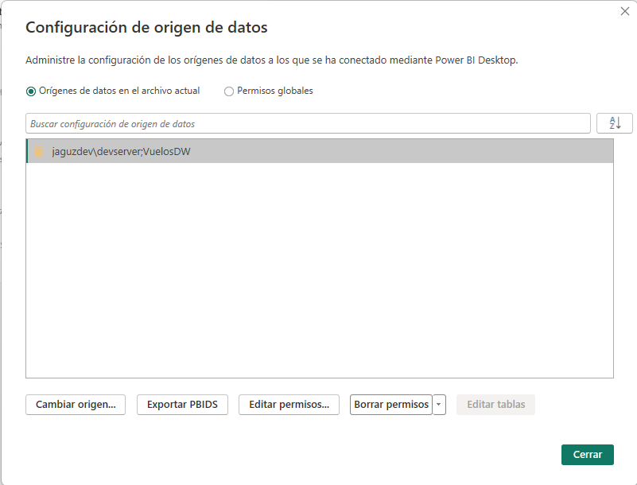

Los datos viajan dentro del archivo. Quien lo abra en otro equipo los verá
cargados y solo necesita apuntar el origen a su propia instancia si quiere
refrescar.

## 2. Modelo tabular

### 2.1 Qué se importa y por qué

`VuelosDW` es un esquema estrella con `Hecho_Boleto` al centro, un boleto por
fila, y once dimensiones alrededor. Dos de ellas cumplen más de un papel.
`Dim_Fecha` se usa como salida, llegada y reserva, y `Dim_Aeropuerto` como
origen y destino. En SQL Server es una sola tabla con varias llaves foráneas y
es el diseño correcto.

Power BI solo permite una relación activa entre dos tablas. Importado tal cual,
el modelo dejaría una sola fecha funcionando y las otras dos mudas, sin que nada
en pantalla lo avise. Un gráfico titulado ingresos por mes de reserva mostraría
en realidad los ingresos por mes de salida.

La solución fueron cinco vistas SQL, una por papel, que Power BI trata como
tablas independientes.

```
Dim_Fecha_Salida         Dim_Aeropuerto_Origen
Dim_Fecha_Llegada        Dim_Aeropuerto_Destino
Dim_Fecha_Reserva
```

No copian datos y cualquier corrección al calendario se refleja en las tres al
instante. Cada vista renombra su llave con el nombre de la columna del hecho a
la que corresponde. Se descartó `USERELATIONSHIP` porque solo funciona dentro de
una medida y un segmentador nunca podría filtrar por mes de llegada. Duplicar
las tablas físicas resolvía Power BI a costa de romper el modelo dimensional.

El modelo queda con quince tablas. La de hechos, las cinco vistas y las nueve
dimensiones de un solo papel. `Dim_Fecha` y `Dim_Aeropuerto` no se importan
porque ya llegan a través de sus vistas.

### 2.2 Relaciones

Catorce relaciones de varios a uno desde `Hecho_Boleto` hacia cada dimensión,
con filtro en una sola dirección. Nueve las detectó Power BI a partir de las
llaves foráneas de la base. Las cinco de las vistas se crearon a mano, porque
una vista no lleva esa metadata.

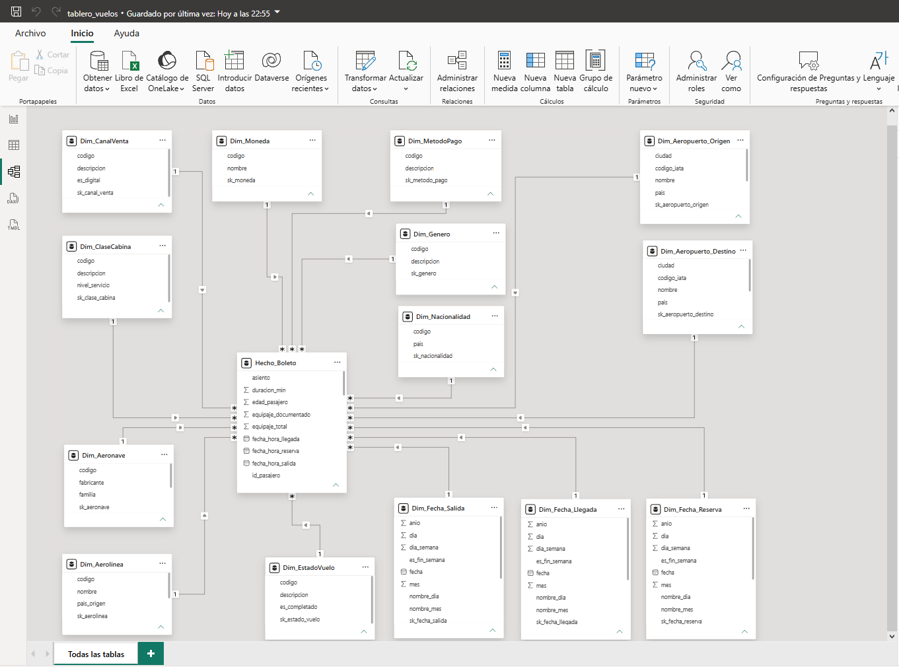

El filtrado bidireccional quedó desactivado en todas. En un esquema estrella no
aporta nada y puede producir totales que no cuadran entre visuales.

### 2.3 Ajustes del lado de Power BI

`nombre_mes` se ordena por la columna `mes` en las tres vistas de fecha. Sin
eso los meses salen en orden alfabético.

Las columnas numéricas del calendario se marcan como No resumir. Power BI las
suma por defecto y una tabla por año que muestra 2,957,794 en lugar de 2024 y
2025 es el resultado.

Ninguna vista de fecha se marca como tabla de fechas. Heredan los miembros
DESCONOCIDO y NO APLICA del calendario, que tienen la fecha en blanco, y Power
BI no lo acepta. Los indicadores usan los atributos `anio`, `mes` y
`nombre_mes`, que no dependen de esa marca.

### 2.4 Jerarquías

| Jerarquía | Tabla | Niveles |
|---|---|---|
| Fecha | las tres vistas de fecha | anio → trimestre → nombre_mes → dia |
| Aeropuerto | `Dim_Aeropuerto_Origen` y `Dim_Aeropuerto_Destino` | pais → ciudad → nombre |
| Aerolínea | `Dim_Aerolinea` | pais_origen → nombre |
| Aeronave | `Dim_Aeronave` | fabricante → familia → codigo |

Permiten bajar de año a mes o de país a aeropuerto dentro del mismo visual.

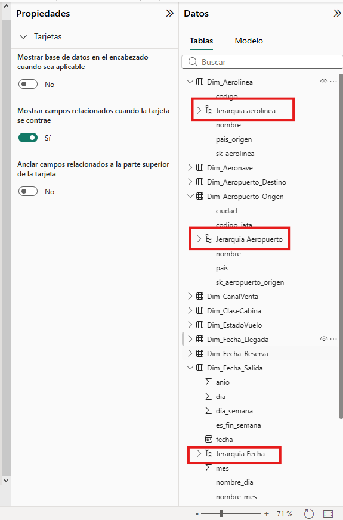

## 3. Medidas DAX

Trece medidas, todas en `Hecho_Boleto`. Las fórmulas completas están en
`dax/medidas.dax`.

| Medida | Definición | Valor sin filtros |
|---|---|---|
| Boletos Vendidos | `COUNTROWS ( Hecho_Boleto )` | 10,000 |
| Ingreso Total USD | `SUM ( precio_boleto_usd )` | 770,024.71 |
| Ticket Promedio USD | Ingreso / Boletos | 77.00 |
| Boletos Puntuales | Boletos con estado `ON_TIME` | 7,278 |
| % Puntualidad | Puntuales / Boletos | 72.78 % |
| % Cancelacion | Cancelados / Boletos | 5.60 % |
| Retraso Promedio Min | `AVERAGE ( retraso_min )` sobre los retrasados | 124.93 |
| Meta Puntualidad | constante 0.73 | 73.00 % |
| Alerta Puntualidad | constante 0.72 | 72.00 % |
| Semaforo | 🟢 🟡 🔴 según los dos umbrales anteriores | 🟡 |
| Ingreso Anio Anterior | Ingreso del año previo al del contexto | blanco |
| % Crecimiento Ingreso | Ingreso menos Anterior, entre Anterior | blanco |
| Boletos sin Nacionalidad | Boletos con nacionalidad DESCONOCIDO | 209 |

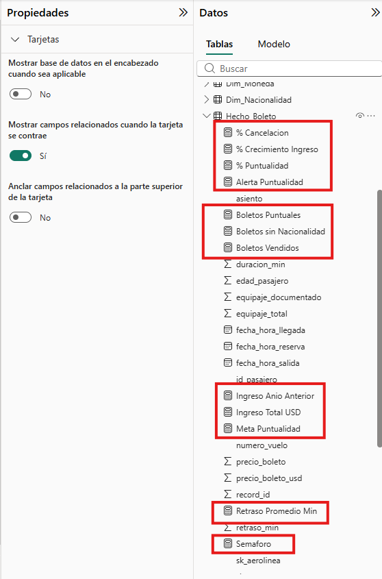

Toda medida de ingreso usa `precio_boleto_usd`. La columna `precio_boleto`
mezcla cuatro monedas y sumarla produce un número sin significado.

El denominador de la puntualidad incluye a los cancelados, porque un vuelo
cancelado no fue puntual. Es la misma definición que usa la consulta sobre la
base y por eso ambos dan 72.78 %.

El retraso promedio usa `AVERAGE`, que ignora los blancos. Los 560 cancelados
tienen retraso nulo porque no aplica. Meterlos en el denominador hundiría el
promedio de 124.93 a 24.6 minutos.

La comparación año contra año no usa funciones de inteligencia de tiempo porque
exigen una tabla marcada como de fechas. Filtrar por `anio` consigue lo mismo.
La medida usa `SELECTEDVALUE` para quedar en blanco en la fila de total y exige
que el año tenga ventas. El calendario llega hasta 2026 y sin esa condición ese
año mostraría el ingreso de 2025 como año anterior con un crecimiento de
menos 100 %.

El semáforo lee los umbrales de `Meta Puntualidad` y `Alerta Puntualidad`. Si
la meta cambia se toca un solo lugar y el KPI, el gráfico de barras y la
columna de iconos se actualizan juntos.

## 4. El KPI de puntualidad

### 4.1 Umbrales

La puntualidad por aerolínea va de 71.08 % a 75.73 %, con un global de 72.78 %.
Una meta de 75 % dejaría once aerolíneas del mismo color. Con la meta en 73 % y
la alerta en 72 % la distribución real se parte en tres grupos legibles.

| Semáforo | Aerolíneas | % Puntualidad |
|---|---|---|
| 🟢 cumple la meta | JetBlue, Delta, Copa Airlines, LATAM, Ryanair | 73.18 % a 75.73 % |
| 🟡 en alerta | Aeromexico, British Airways, Iberia | 72.55 % a 72.80 % |
| 🔴 bajo la alerta | United, American Airlines, Avianca, Southwest | 71.08 % a 71.89 % |

### 4.2 Presentación

El indicador aparece de tres formas y las tres comparten los mismos umbrales.

El visual KPI de la página Resumen compara `% Puntualidad` contra
`Meta Puntualidad` con el año de salida como tendencia. Muestra el último año
con datos, 72.38 % en 2025, en rojo y 0.84 puntos por debajo de la meta. Un
filtro del visual limita el eje a 2024 y 2025. La meta es una constante y sin
ese filtro Power BI pintaría también 2026, un año sin vuelos.

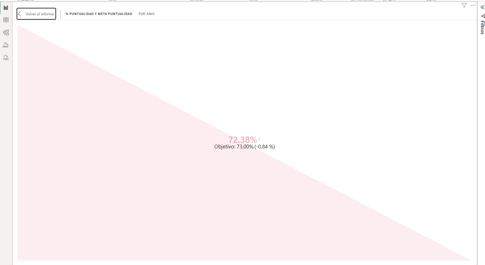

El gráfico de barras por aerolínea colorea cada barra con reglas de formato
condicional sobre los mismos umbrales. Ordenado de mayor a menor deja ver de un
vistazo cuáles cinco cumplen y cuáles cuatro están lejos.

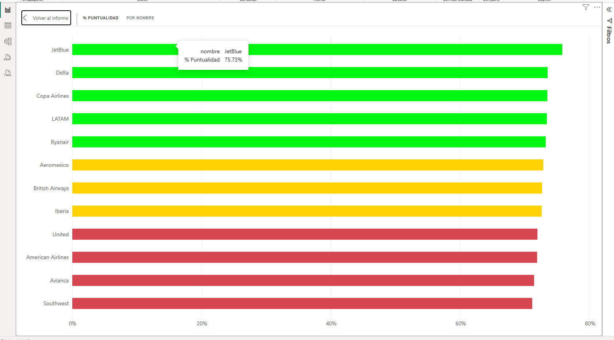

La columna `Semaforo` de la tabla de aerolíneas pone el icono junto al
porcentaje. En la fila de total sale amarillo, que es la lectura correcta del
72.78 % global.

### 4.3 Lectura

La puntualidad es un problema del sistema y no de una aerolínea. Ninguna de las
doce está lejos del promedio, y entre 2024 y 2025 el global bajó de 73.19 % a
72.38 % mientras el volumen subía de 4,927 a 5,073 boletos. Uno de cada cinco
vuelos sale con retraso y el retraso promedio es de 125 minutos. Los 1,970
vuelos retrasados suman 4,101 horas de espera. A eso se agrega un 5.6 % de
cancelaciones.

Para operaciones, el semáforo dice dónde mirar primero. Southwest, Avianca,
American y United concentran el problema, y las tres en amarillo están a menos
de medio punto de caer al rojo.

## 5. Dashboard

### 5.1 Páginas

Resumen es la portada. Tres tarjetas con boletos, ingreso y ticket promedio, el
visual KPI y los tres segmentadores.

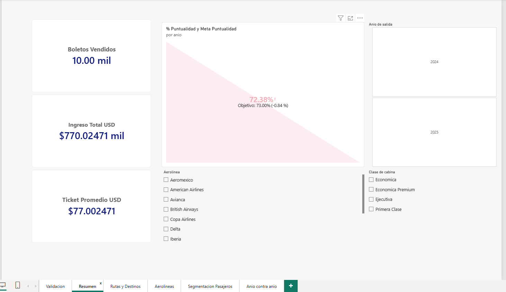

Aerolineas desarrolla el indicador de puntualidad. La tabla con semáforo da los
doce valores exactos, el gráfico de barras los ordena y colorea, y el gráfico
de líneas compara el ingreso mensual de 2024 y 2025.

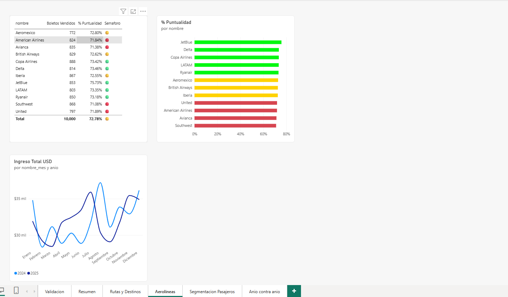

Rutas y Destinos muestra los cinco destinos con más boletos, con un filtro Top N
sobre `Boletos Vendidos`, y las rutas origen destino ordenadas por volumen. Es
el visual que usa las dos vistas de aeropuerto a la vez y por eso prueba que
ambas relaciones quedaron bien.

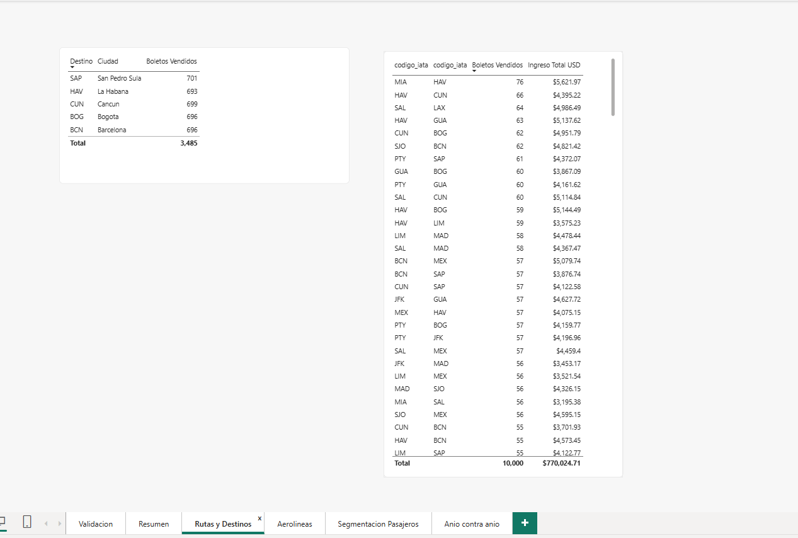


Segmentacion Pasajeros perfila quién compra. Tres tablas, clase de cabina,
genero y nacionalidad, muestran boletos e ingreso donde aplica. La tarjeta de
Boletos sin Nacionalidad queda junto a su tabla para que el vacío de datos se
vea en el mismo lugar donde se explica.

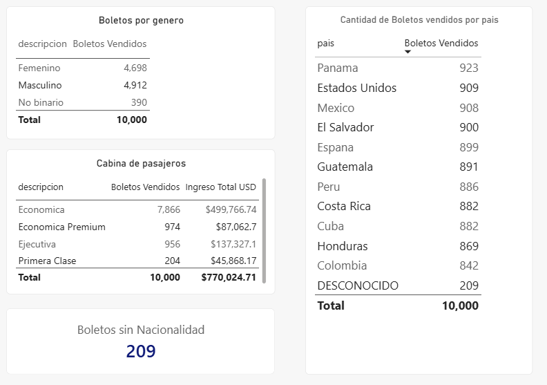

Anio contra Anio aisla la comparacion 2024-2025 que ya se referencia en las
medidas de crecimiento. La tabla cruza anio, boletos, ingreso, puntualidad,
Ingreso Anio Anterior y % Crecimiento Ingreso, filtrada para excluir 2023 y
2026, que existen en el calendario pero no tienen boletos. Un gráfico de
columnas y una tarjeta con el -0.17 % refuerzan el mismo dato en dos formatos.

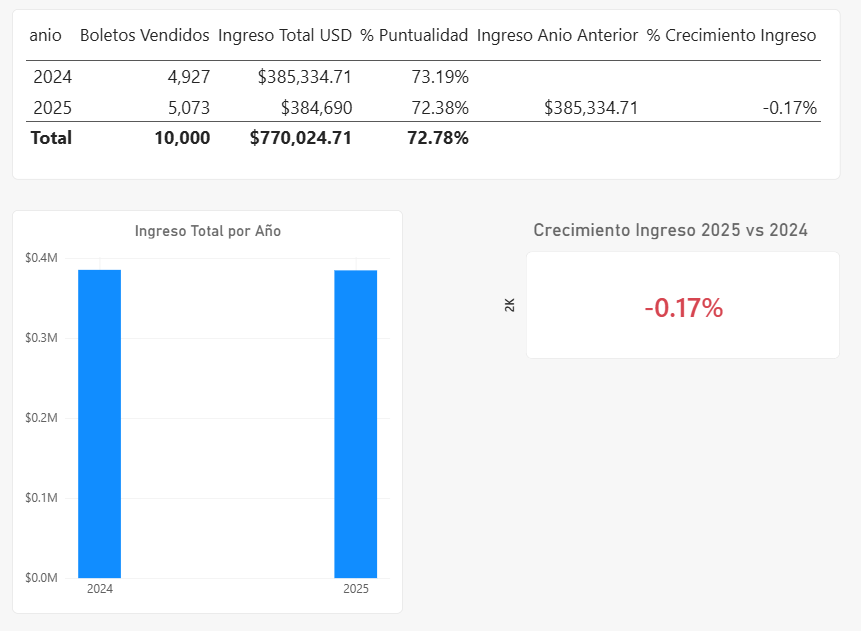


Validacion reúne todas las medidas y desgloses que tienen un valor de
referencia conocido. No forma parte de la presentación ejecutiva.

### 5.2 Interactividad

Los tres segmentadores de Resumen filtran año de salida, aerolínea y clase de
cabina. En las demás páginas los visuales se filtran entre sí al hacer clic en
una barra o una fila.

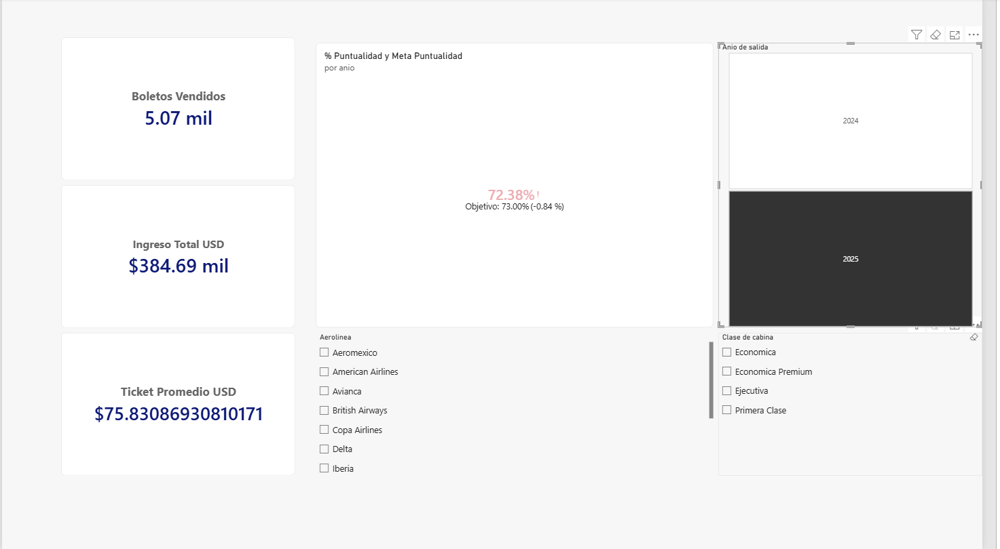

Cada segmentador lleva un filtro sobre `Boletos Vendidos` distinto de blanco.
Oculta el DESCONOCIDO de aerolínea y de clase, que existe en la dimensión pero
ningún boleto usa, y los años 2023 y 2026 del calendario.

Ese filtro no se aplica en nacionalidad ni en canal de venta. Ahí el
DESCONOCIDO tiene 209 y 144 boletos y representa información que el archivo
original no traía. Ocultarlo en un visual y mostrarlo en otro haría que los
porcentajes dejaran de cuadrar entre páginas. Lo mismo vale para los 560
boletos con fecha de llegada NO APLICA, que son los vuelos cancelados.

### 5.3 Series de tiempo sobre la fecha de salida

Todo visual con eje temporal usa `Dim_Fecha_Salida`. En 2,211 de los 10,000
registros la fecha de reserva del archivo original es ambigua y el proceso de
carga resolvió el empate por convención. La fecha de salida no tiene ese
problema porque la duración del vuelo la fija con precisión de minutos. Una
tabla por año de reserva muestra además un 2023 con 845 boletos, reservas
anticipadas de vuelos de 2024, que confunde la comparación anual.

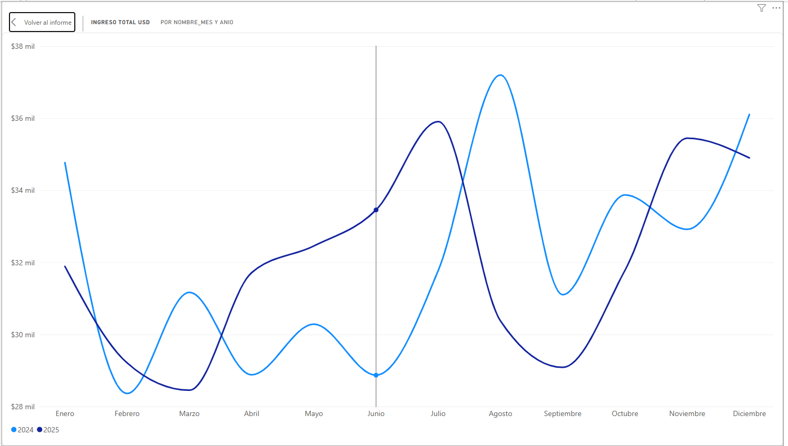

## 6. Validación contra la base

Antes de construir un solo visual se comprobó que las medidas reproducen los
valores de `docs/valores_esperados.md`, que salen de consultas SQL directas
sobre `VuelosDW`. Un número que no cuadra casi siempre es una relación apuntando
a la columna equivocada, y conviene descubrirlo antes de tener diez gráficos
encima.

| Comprobación | Esperado | Tablero |
|---|---|---|
| Boletos Vendidos | 10,000 | 10,000 |
| Ingreso Total USD | 770,024.71 | 770,024.71 |
| Boletos Puntuales | 7,278 | 7,278 |
| % Puntualidad | 72.78 % | 72.78 % |
| % Cancelacion | 5.60 % | 5.60 % |
| Retraso Promedio Min | 124.93 | 124.93 |
| Boletos sin Nacionalidad | 209 | 209 |
| 2024 boletos / ingreso / puntualidad | 4,927 / 385,334.71 / 73.19 % | igual |
| 2025 boletos / ingreso / puntualidad | 5,073 / 384,690.00 / 72.38 % | igual |
| 2025 Ingreso Anio Anterior / % Crecimiento | 385,334.71 / −0.17 % | igual |
| Top 5 destinos | SAP 701, CUN 699, BCN 696, BOG 696, HAV 693 | igual |
| Ruta más transitada | MIA–HAV, 76 boletos, 5,621.97 USD | igual |
| Semáforo por aerolínea | 5 verde, 3 amarillo, 4 rojo | igual |

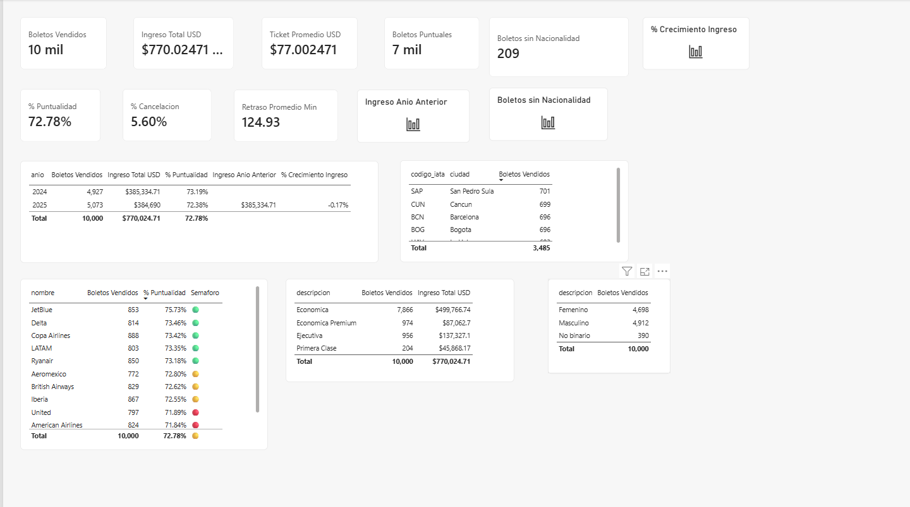

Barcelona y Bogotá empatan en 696 boletos y el orden entre ambas puede variar.
La fila 2024 deja en blanco las medidas de año contra año porque no hay 2023
con qué comparar. Ninguno de los dos casos es un error.

## 7. Conclusiones

El ingreso está estancado aunque se vende más. 2025 colocó 146 boletos más que
2024 y facturó 645 dólares menos, porque el ticket promedio cayó de 78.21 a
75.83 USD. Crecer en volumen a costa de precio no es sostenible y el tablero lo
deja ver en una sola fila.

La cabina económica llena los aviones y las otras pagan la cuenta. El 78.7 % de
los boletos son económicos pero aportan el 64.9 % del ingreso. Ejecutiva y
Primera Clase son el 11.6 % de los pasajeros y el 23.8 % del dinero. Cualquier
esfuerzo comercial sobre las cabinas altas mueve más el ingreso.

El tráfico está muy repartido. Ningún destino pasa del 7.1 % del total y los
cinco primeros se separan por ocho boletos. No hay una ruta dominante de la que
dependa el negocio.

Faltan datos en el origen. 209 boletos sin nacionalidad y 144 sin canal de venta
son un 3.5 % del archivo que el sistema transaccional no registró. El tablero
los muestra en lugar de esconderlos, porque medir una captura deficiente es el
primer paso para corregirla.

## 8. Estructura del repositorio

```
Practica2/
├── tablero_vuelos.pbix       Archivo de Power BI
├── informe_tecnico.md        Este documento
├── README.md                 Orden de trabajo para reconstruir todo
├── capturas/                 Imágenes del dashboard
├── dax/medidas.dax           Las trece medidas con su justificación
├── docs/
│   ├── modelo_powerbi.md     Las vistas de rol y cómo importar
│   ├── valores_esperados.md  Línea base de validación
│   └── 798_Practica_2_2S2026.pdf
└── sql/vistas_powerbi.sql    Las cinco vistas de rol
```

La reconstrucción completa está descrita paso a paso en `README.md`. Las
medidas se pegan una por una desde `dax/medidas.dax`, las de la sección Base
primero porque el resto las referencia.
