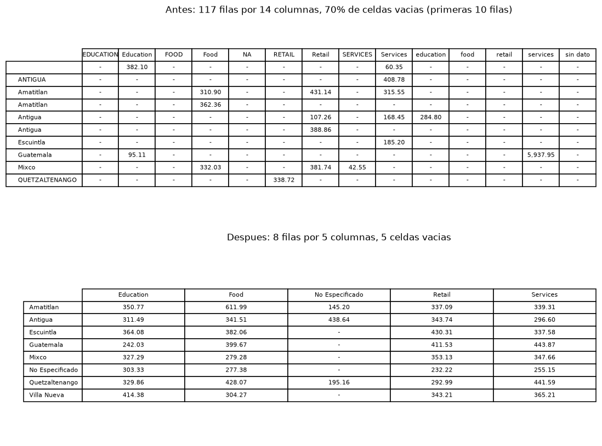
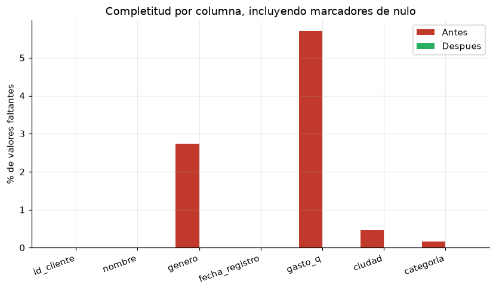
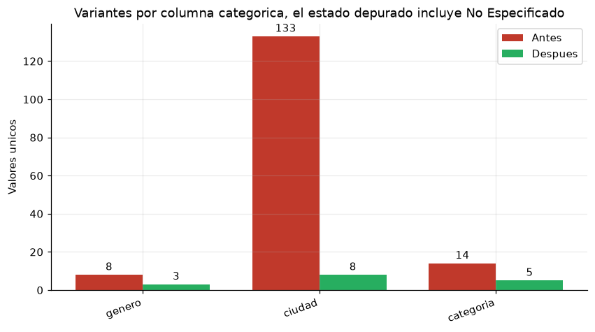
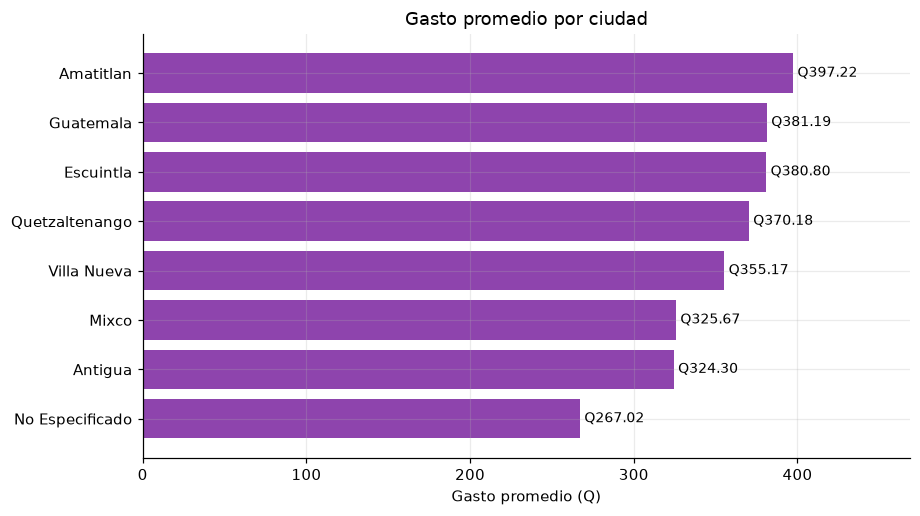

# Tarea #1 — Limpieza y análisis inicial de datos con Python y Pandas

Universidad de San Carlos de Guatemala — Facultad de Ingeniería
Ingeniería en Ciencias y Sistemas — Seminario de Sistemas 2 — 2S 2026
Estudiante: Joel · Carné: 202201395

## Dataset utilizado

`data/dataset_sucio.csv`, un registro de clientes con su gasto asociado: 5,000 filas y 7 columnas
(`id_cliente`, `nombre`, `genero`, `fecha_registro`, `gasto_q`, `ciudad`, `categoria`), con fechas del
01/01/2026 al 28/03/2026.

El diagnóstico inicial encontró filas repetidas e `id_cliente` duplicados, celdas vacías en `gasto_q`
y `genero`, marcadores de ausencia escritos como texto (`NA`, `sin dato`, celdas en blanco), dos
formatos de fecha conviviendo (`YYYY-MM-DD` y `DD/MM/YYYY`), dos separadores decimales, y 133 variantes
de escritura de `ciudad` para 7 ciudades reales.

## Proceso de limpieza

Todo el proceso está en `limpieza_analisis.ipynb`. El archivo se lee con `dtype=str` para no perder
evidencia antes de diagnosticarla: si Pandas infiriera los tipos, convertiría en `NaN` los montos con
coma decimal antes de poder verlos.

| # | Transformación | Técnica | Resultado |
|---|---|---|---|
| 1 | Eliminación de duplicados | `drop_duplicates()` sobre la fila completa y sobre `id_cliente` | 131 filas repetidas y 197 con id duplicado, 328 eliminadas en total |
| 2 | Estandarización de valores | Marcadores de nulo a `NaN`; `strip()`, colapso de espacios, `title()` y NFKD sin acentos; catálogo `Femenino`/`Masculino` | ciudad de 133 a 7 variantes, categoria de 14 a 4, genero de 8 a 2 |
| 3 | Estandarización de formatos | Fechas parseadas por formato explícito a `datetime64`; coma a punto antes de `to_numeric()` | 2,234 montos recuperados que se habrían perdido como `NaN` |
| 4 | Tratamiento de celdas vacías | Mediana por categoría en `gasto_q`, marcada en `gasto_imputado`; categóricas a `No Especificado`; descarte de filas sin fecha | 263 montos imputados, 152 celdas etiquetadas, 0 filas descartadas |
| 5 | Validación | Aserciones de integridad al cierre del proceso | Sin duplicados, sin nulos y con los tipos esperados |

El orden de los pasos importa. Los marcadores de nulo se normalizan antes de aplicar `title()`, porque
si no `NA` se convertiría en `Na` y pasaría por una categoría más; y el separador decimal se corrige
antes de imputar, para no imputar sobre una columna que todavía es texto.

La mediana por categoría se prefirió a la media global porque resiste mejor los valores extremos. El
género faltante no se imputó con la moda, ya que inventar un atributo demográfico sesgaría cualquier
decisión posterior. Los valores imputados quedan marcados en `gasto_imputado` porque sumarlos infla el
gasto total en 3.91%, así que los totales se calculan solo sobre los montos reales.

## Capturas de las tablas y visualizaciones

Tablas pivote con el gasto promedio por ciudad y categoría, antes y después de la limpieza:



Completitud por columna, contando también los marcadores de nulo escritos como texto:



Variantes distintas en las columnas categóricas:



Gasto promedio por ciudad sobre el dataset depurado:



## Interpretación de los resultados

| Indicador | Antes | Después |
|---|---|---|
| Registros | 5,000 | 4,672 |
| Filas duplicadas | 131 | 0 |
| `id_cliente` repetidos | 328 | 0 |
| Celdas vacías | 422 | 0 |
| Variantes de `ciudad` y `categoria` | 133 y 14 | 7 y 4, más la etiqueta `No Especificado` |
| Pivote ciudad × categoría | 117×14, con 70% de celdas vacías | 8×5, con 12% de celdas vacías |

El separador decimal mezclado fue el problema de mayor impacto. Casi la mitad de los montos usaba coma,
y `to_numeric` los habría convertido en `NaN` sin lanzar ningún error, así que el análisis habría
corrido completo sobre la mitad de los datos.

La estandarización de texto es lo que vuelve legible la tabla pivote. La misma consulta pasó de 117
filas irreales, con la mayoría de celdas vacías, a 8 filas donde cada ciudad concentra todo su gasto.
Para Pandas, `quetzaltenango`, `Quetzaltenango` y `  QUETZALTENANGO ` eran tres entidades distintas.
Las pocas celdas vacías que quedan son cruces con `No Especificado`, que agrupa pocos registros: son
ausencias visibles y no información perdida en silencio.

La deduplicación era condición previa para cualquier métrica, porque las 328 filas repetidas inflaban
los conteos por ciudad y categoría.

Sobre el dataset depurado el gasto promedio es Q361.07 y la mediana Q244.26. Esa diferencia refleja una
distribución asimétrica y confirma que la mediana era la medida adecuada para imputar. El mayor gasto
promedio está en Amatitlán, la categoría con más clientes es Retail y el gasto total sobre valores
reales es Q1,623,416.39.

Queda un hallazgo sin corregir: hay registros donde el género declarado no concuerda con el nombre de
pila. El nombre no es un predictor confiable del género, así que se documenta como un problema de
exactitud, según la ISO/IEC 25012, que debe resolverse en el sistema de captura y no en el pipeline.

## Estructura y ejecución

```
Tarea1/
├── limpieza_analisis.ipynb
├── README.md
├── requirements.txt
├── data/   dataset_sucio.csv · dataset_limpio.csv · dataset_limpio.parquet
└── img/    01_completitud.png · 02_cardinalidad.png · 03_pivotes.png · 04_gasto_ciudad.png
```

```bash
pip install -r requirements.txt
jupyter notebook limpieza_analisis.ipynb
```

Las cifras de este documento corresponden a la ejecución completa del notebook sobre
`data/dataset_sucio.csv`.
