### Descripción

> El dataset contiene información relacionada con usuarios datos como identificador unico, nombre del usuario, sexo del usuario, fecha de registro del usuario, cantidad de gasto del usuario, ciudad del usuario y categoria en la compra.  El dataset es para analizar los gastos realizados por los usuarios en las diferentes ciudades donde ha visitado y en que categoria ha gastado

---

# 3. Objetivo

El objetivo de esta práctica es realizar un proceso de limpieza y transformación de datos utilizando Python y Pandas, aplicando técnicas para mejorar la calidad, consistencia y confiabilidad de la información.

Durante el proceso se realizaron las siguientes transformaciones:

- Eliminación de registros duplicados.
- Tratamiento de celdas vacías o valores faltantes.
- Estandarización de valores y formatos.
- Verificación de los resultados obtenidos.

---

# 4. Herramientas utilizadas

Las herramientas y tecnologías utilizadas fueron:

- **Python 3**
- **Pandas**
- **Matplotlib** [si aplica]
- **Seaborn** [si aplica]
- **Jupyter Notebook / Google Colab / VS Code**
- **Dataset en formato CSV**

---

## 2. Dataset utilizado

### Nombre del dataset

**[dataset_sucio.csv]**

### Fuente

El dataset utilizado para esta práctica fue obtenido de:

- **Fuente:** [Kaggle / archivo CSV proporcionado]
- **Nombre del archivo:** `[dataset_sucio.csv]`
- **Cantidad de registros iniciales:** [5000]
- **Cantidad de columnas:** [7]

# Entorno de trabajo

instalar Python 3
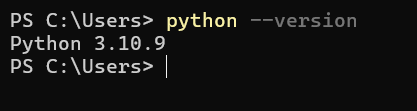

En VS Code instala estas extensiones:

Python — Microsoft
Jupyter — Microsoft

En la terminal crear entorno virtual

$ python -m venv .venv
$ .venv\Scripts\activate

si todo esta bien se deberia ver algo asi

(.venv) PS C:\...\Tarea1>

actualizar pip

$ python -m pip install --upgrade pip

Instalar pandas

$ pip install pandas

comprobar la isntalacion

$ python -c "import pandas as pd; print(pd.__version__)"

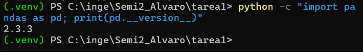

Instalar Matplotlib

$ pip install matplotlib

comprar la instalacion
$ python -c "import matplotlib; print(matplotlib.__version__)"

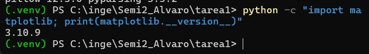

Instalar Seaborn
$ pip install seaborn

comprabar su instalacion 
$ python -c "import seaborn as sns; print(sns.__version__)"

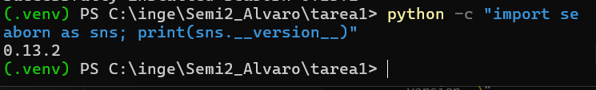
Instalar Jupyter

Para trabajar con el archivo .ipynb:

$ pip install jupyter

# Limpieza y Transformación de Datos

## importacion y estado original

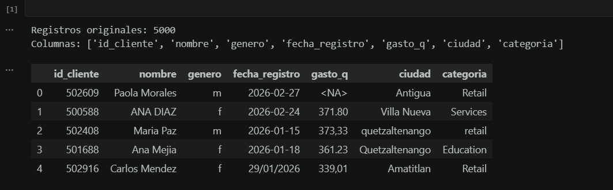

## Valores faltantes en el estado original

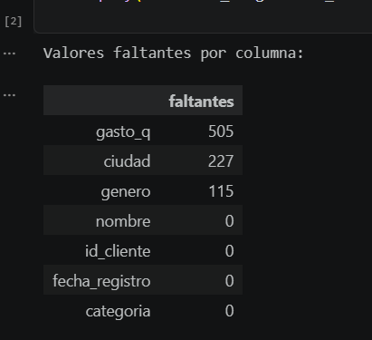

## valores duplicados
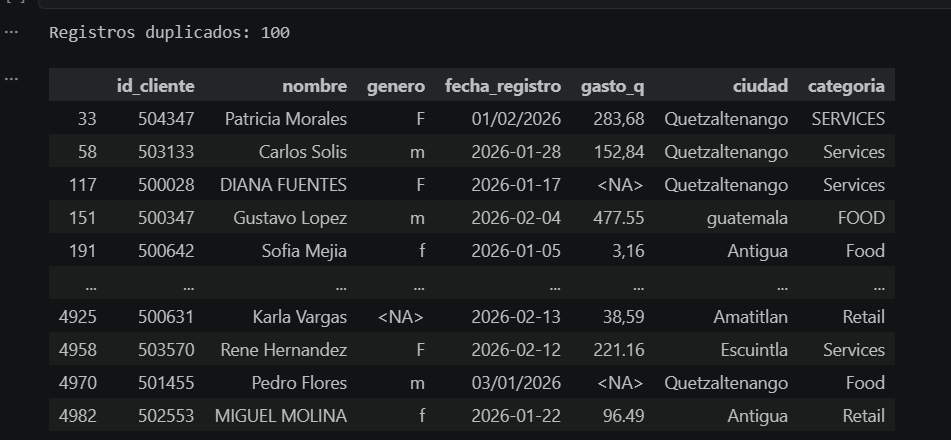

## estandarizacion genero 
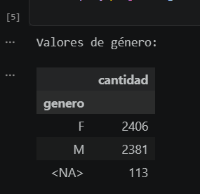

## estandarizacion ciudad
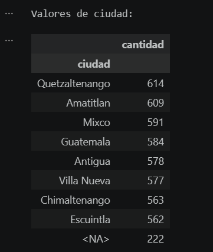

## estandarizacion categoria

## estandarizacion fecha
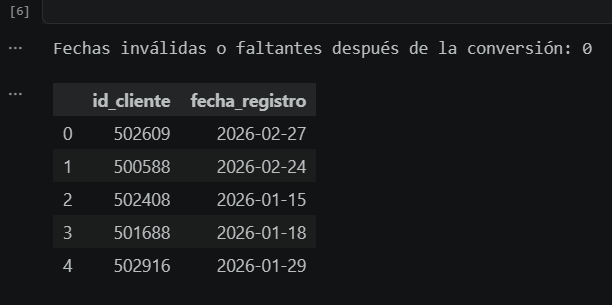

## estandarizacion moneda

## tratamiento de valores faltantes
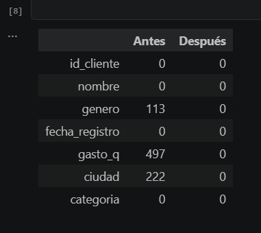

## tratamiento de valores faltantes
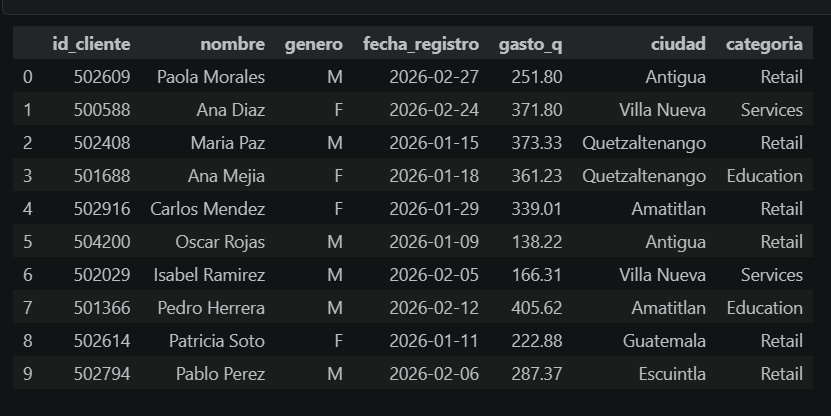

## Gastos total por ciudad
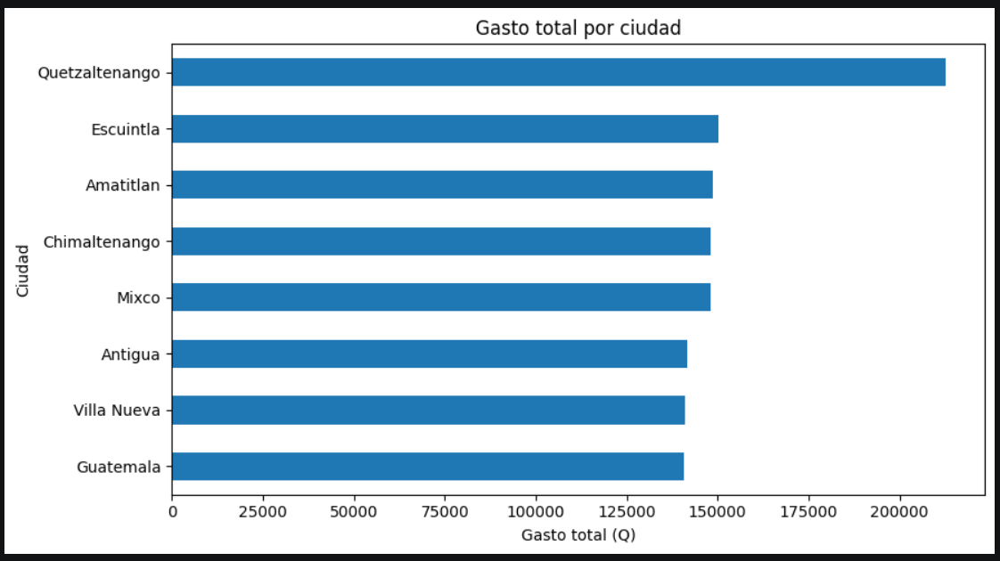

## Gastos total por categoria
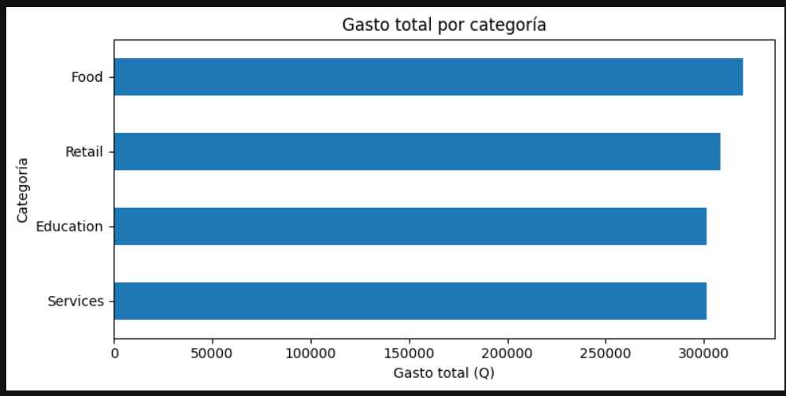

##  Interpretación de resultados

- El dataset original se conserva mediante `df_original` y las transformaciones se realizan sobre `df`.
- Los duplicados completos se identifican y eliminan mediante `drop_duplicates()`.
- Los valores faltantes se cuantifican antes y después de la limpieza. El gasto se completa con la mediana y las variables categóricas con la moda.
- Las fechas quedan en un formato uniforme y `gasto_q` queda como variable numérica en Quetzales.
- Las columnas de texto se normalizan para evitar diferencias causadas por espacios y uso inconsistente de mayúsculas/minúsculas.
- Las tablas pivote permiten comparar el gasto por ciudad, categoría y género, mientras que las gráficas facilitan identificar diferencias entre grupos.
